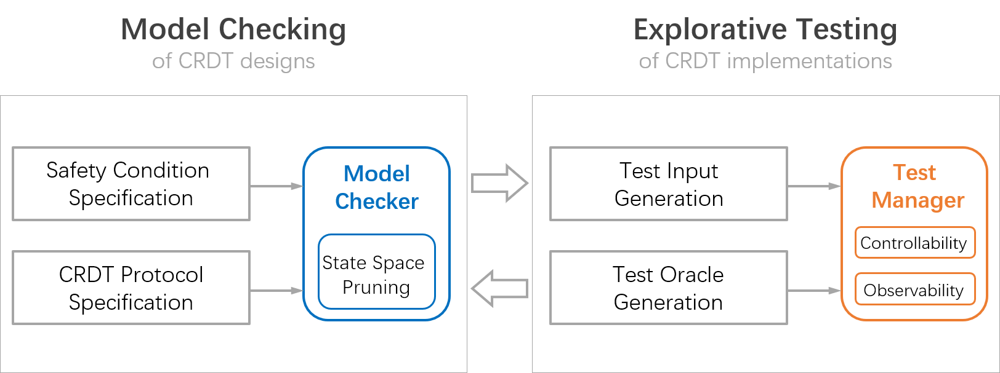

# MET for CRDT-Redis

Model-based explorative testing (MET) for CRDT-Redis.

MET helps with the correctness of the design and the implementation of CRDTs in the system.

- **Design** : Use TLA+ to specify the design, model-check it using TLC.
- **Implementation** : Conduct explorative testing using the output of former model checking. Systematically test the system with all possible scenarios.

## How To Do MET

After you have deployed the CRDT-Redis on your machine and be sure that it works properly, there are mainly two steps to redo the MET we have done (or you want to additionally MET test your own CRDT).

### Model Checking

First you need to specify the CRDTs into TLA+ models. We have put our TLA+ models of RWF-RPQ and RWF-List in the folder *TLA*. Note that you need to add history variables and output the final states of the system in your models.

Then you may set proper parameters to limit the scale of model checking, and run TLC model checker to check the models. Fix any bugs you found during the process. You may use `-userFile` option for model checker to output the final states in a file. This is for further explorative testing.

### Explorative Testing

**Step 1.** Generate test cases using the output of model checking. We have *parse.py* for the TLA+ models we wrote in their folders.

**Step 2.** Write the test drivers to 1) read the test input to test the system and 2) read the state of the system to check the test oracle. You may use the framework here and write the driver in *op_script.h* and *oracle.h*.

**Step 3.** Enhance the testability of the CRDT-Redis. Make sure that `CRDT_EXPERIMENT` is defined in [CRDT_exp.h](../redis-6.0.5/src/CRDT_exp.h). You do not need to worry about the controllability. Write additional read operations in CRDT-Redis if needed for observability.

**Step 4.** Write the testing steps in *main.cpp*. You may refer to the existing exemplar code. Compile and run the testing. Fix the bugs you may encounter with the help of the output.
