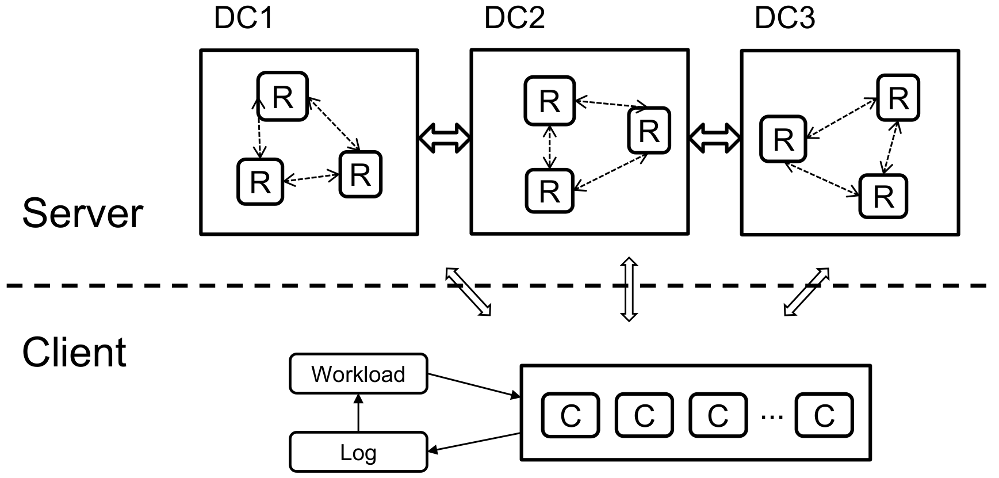

# CRDT Experiments

Here are the tests and the experiments we do on our CRDT implementations. There are 3 folders here:

* *redis_test* : The testing bash scripts and server configuration files. Also used in the experiment.
  * **.sh* : Bash scripts for starting and testing on local machine.
  * *test.py* : Local test we do to test the correctness of our CRDT implementations.
  * *connection.py* : Used for experiments using virtual machines. Construct the server part of experiment framework, close it and clean it when the experiment is finished. It use ssh to control the server VMs to start their Redis instances, construct replication among them, and add networking delay between them. When the experiment is finished, close all the server and remove their .rdb and .log files.
* *bench* : The experiment code. Constructs the experiment, generates and runs operations, get logs and results.
  * *exp_env.h* : Construct the experiment environment. Start servers, construct replication, setup delays. Shutdown and cleanup when this round finishes.
  * *exp_runner.h* : Run the exp. Start client threads, calls the generator and periodically read from server to log.
  * *exp_setting.h* : The setting parameters of this round of experiment.
  * *queue_log.h*, *queue_log.cpp* : Log the execution of the write operations and the results of the read operations during the experiment. Write the results to the *result* folder at the end of the experiment.
  * *main.cpp* : The entry of the experiment.
  * *util.h* : Some utilities: random generator, redis client, redis reply. And the base classes of the CRDT experiments:
    * cmd : the CRDT command
    * generator : cmd generation logic
    * rdt_exp : experiment settings and experiment instance generation
    * rdt_log : log the CRDT execution and read result, write result to *result* folder
  * *rpq* and *list* : Actual RPQ and List experiment folder. They extend the base classes in *util.h*, and implement the specific CRDT experiment logics.
* *result* : The results and the data analysis.
  * **.py* : The python scripts to compute the statistics of the result data and draw result figures.

## Experiment Framework

<div align=center></div>

We run all server nodes and client nodes on a workstation. Logically we divide the Redis servers into 3 data centers. Each data center has 1-5 instances of Redis.
We achieve this by designating different localhost IPs for different kind of connections (e.g. 127.0.0.1 for client-server connection, 127.0.0.2 for between data center connection, and 127.0.0.3 for within data center connection).

The entry of the experiment is *bench/main.cpp*. It will do the pattern comparison experiment first, and then 16 rounds of environment related experiment for each environment settings.
The results will be written in the *results* folder in different subfolders according to different CRDTs, experiment settings and rounds.

## Perform the Experiment

To perform our CRDT experiments, follow the instructions below. First you need to [compile the CRDT-Redis](../README.md#build). You can modify the IP settings at *bench/exp_env.h* if you want to use other IPs for servers. Then start the experiment:

```bash
cd bench
make run
```

You need to enter the sudo password for using tc to control message delay.

After it finishes you will get the data in the *result* folder.
You may then draw figures by (python 3.6 required):

```bash
cd ../result
python result.py
```

For more details of our implementation and experiment, please read the *Performance measurements* section of [the technical report](https://arxiv.org/abs/1905.01403) and [the article](../document/add-win-crpq.pdf).
